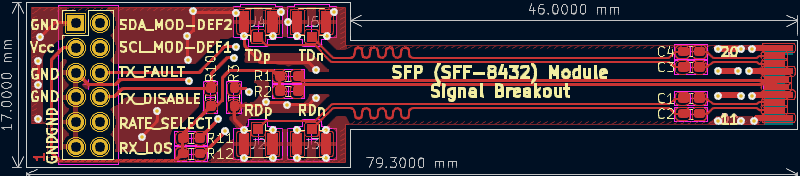
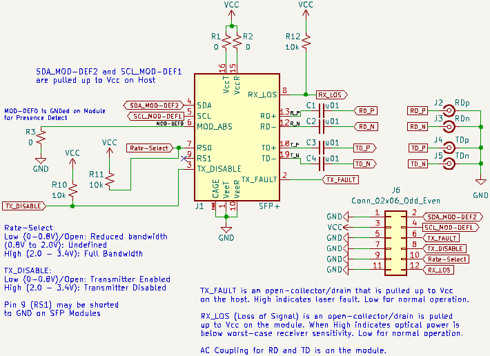

**Work-in-Progress** - [First Revision gerbers ready](https://github.com/mwrnd/SFP_Plug_Breakout/releases/tag/v0.1-alpha). Not yet ordered or tested.

# SFP_Plug_Breakout

Pluggable [SFP (SFF INF-8074i)](https://members.snia.org/document/dl/26184) and [SFP+ (SFF-8432)](https://members.snia.org/document/dl/25892) Module Breakout for developing SFP modules. PCB must be manufactured with a **1.0mm** thickness.

Similar Projects: [SFP-Breakout-Board](https://github.com/aewallin/SFP-Breakout-Board/tree/df46707f1ecbe9b7fed1791247dec31a45b60560), [SFP_BreakoutBoard](https://github.com/kingyoPiyo/SFP_BreakoutBoard), [SFP-Loopback-Board](https://github.com/aewallin/SFP-Loopback-Board), and [Sfp-breakout](https://osmocom.org/projects/misc-hardware/wiki/Sfp-breakout)(*osmocom.org*).

## PCB Layout

Differential pair parameters were calculated based on a **board thickness of 1.0mm**.

## Schematic

